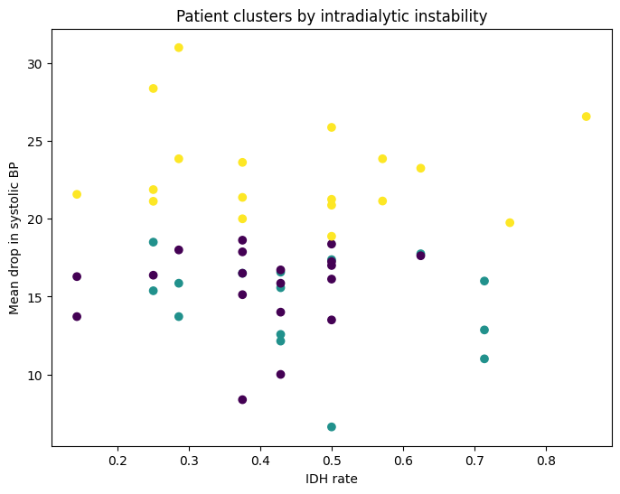
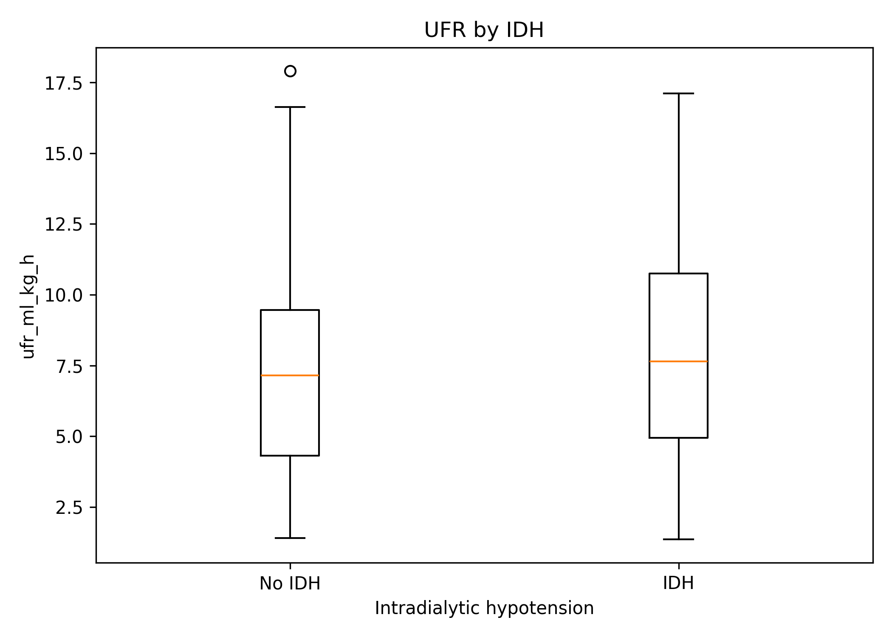
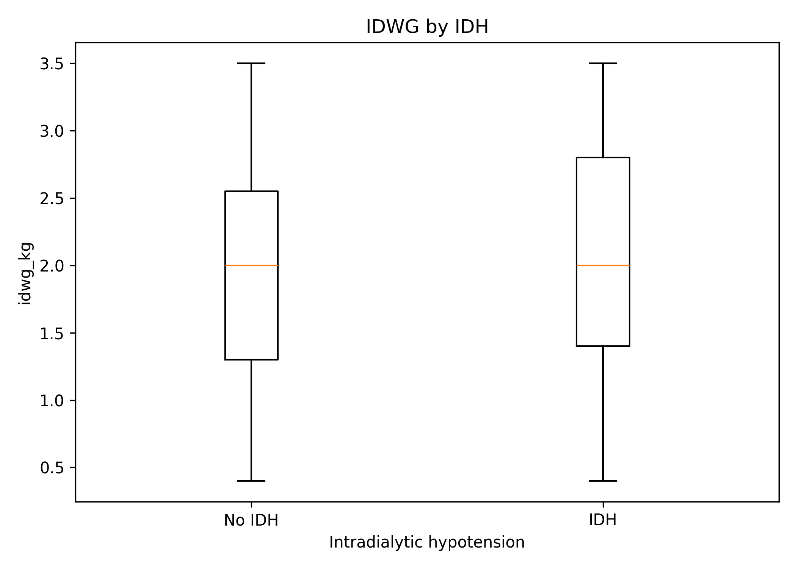
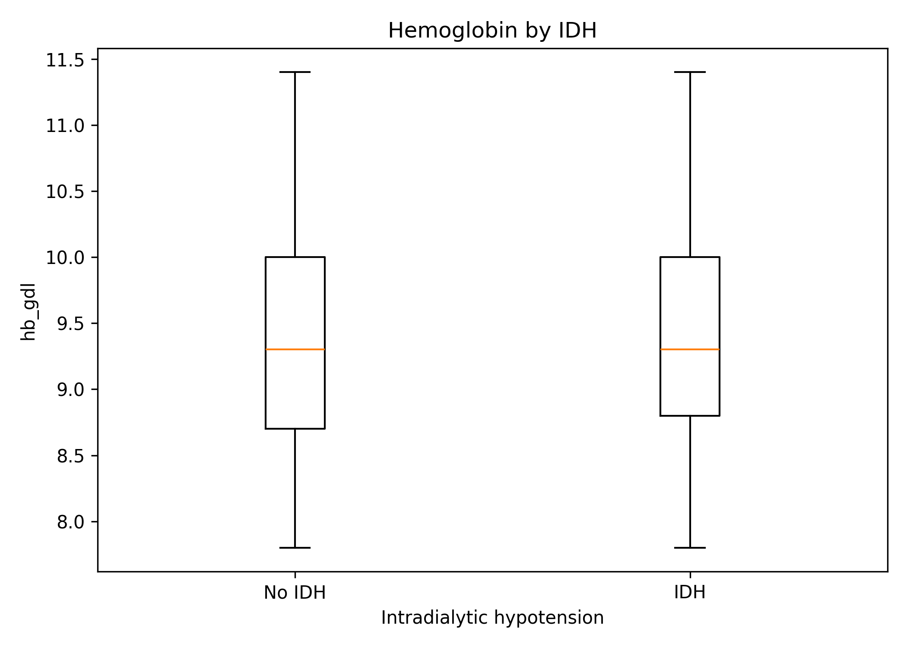
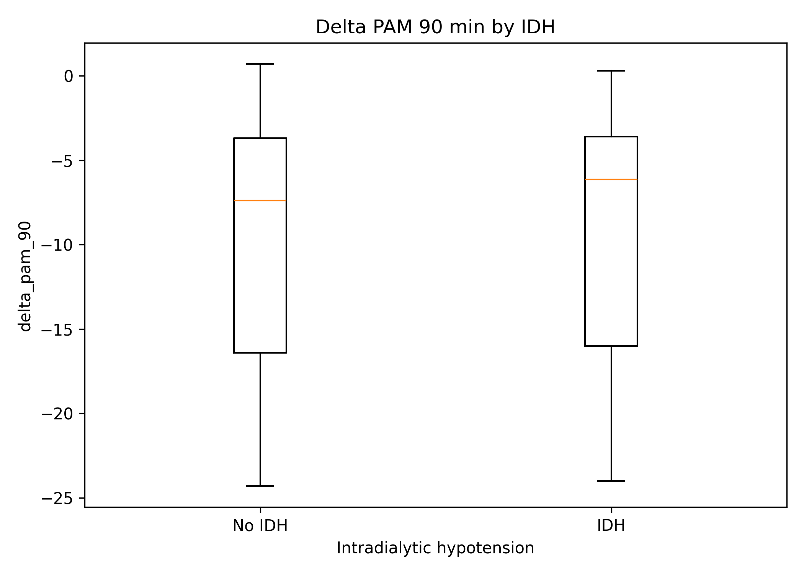

# Hemodialysis Intradialytic Hypotension Risk Analysis
### Patient-Level Hemodynamic Phenotyping Using Real-World Dialysis Data

*Patient-level clustering based on intradialytic instability, blood pressure drop, ultrafiltration rate, and saline use.*
---

## Background

Intradialytic hypotension (IDH) is one of the most frequent and clinically significant complications during hemodialysis. It is associated with increased morbidity, impaired dialysis tolerance, and potential long-term cardiovascular consequences.

Traditionally, IDH has been attributed to session-level factors such as ultrafiltration rate (UFR), interdialytic weight gain (IDWG), and anemia. However, these variables often fail to fully explain the variability observed in clinical practice.

---

## Objective

To analyze real-world hemodialysis data in order to:

- Identify factors associated with intradialytic hypotension (IDH)
- Evaluate the role of session-level vs patient-level variables
- Develop a simple clinical risk score
- Characterize patient phenotypes using clustering techniques

---

## Data Source

This study is based on real-world hemodialysis session data collected from the MARVESA dialysis center in the Dominican Republic.

Data were extracted directly from Nikkiso DBB-06 dialysis machines and include:

- Blood pressure measurements at multiple time points
- Ultrafiltration parameters
- Dialysis session characteristics
- Clinical interventions such as saline administration, UF pause, and early session termination

The dataset includes:

- **394 dialysis sessions**
- **52 patients**
- Longitudinal patient-level data
---

## Methods

### Data Processing

- Cleaning and normalization of raw dialysis data
- Handling missing values and inconsistent entries
- Feature engineering:
  - Δ Mean Arterial Pressure (MAP)
  - Maximum systolic drop
  - IDH binary classification
  - Interdialytic weight gain (IDWG)
  - Ultrafiltration rate (UFR)

---

### Statistical Analysis

- Descriptive statistics by IDH status
- Comparison of session-level variables:
  - UFR
  - IDWG
  - Hemoglobin
- Analysis of categorical variables:
  - Vascular access
  - Left ventricular function (FEVI)
  - Infection status

---

### Risk Score Development

A simple clinical risk score was constructed using:

- UFR > 10 ml/kg/h
- IDWG > 3 kg
- Hemoglobin < 10 g/dL
- Catheter access
- Reduced FEVI
- Recent infection

---

### Clustering Analysis

Patient-level aggregation was performed using:

- IDH rate per patient
- Mean Δ MAP
- Mean systolic drop
- Mean UFR
- Saline use frequency

K-means clustering (k=3) was applied to identify patient phenotypes.

---

## Results

### Global Findings

- **Dialysis sessions analyzed:** 394
- **Unique patients:** 52
- **IDH events:** 170
- **Overall IDH rate:** 43.15%
- **Mean UFR:** 7.59 ml/kg/h
- **Mean IDWG:** 1.99 kg
- **Mean Hemoglobin:** 9.4 g/dL

### Session-Level Findings

Classical session-level variables showed limited discriminatory ability between IDH and non-IDH sessions.

- UFR was only slightly higher in IDH sessions
- IDWG showed minimal difference
- Hemoglobin did not meaningfully separate the groups

These findings suggest that traditional session-level variables alone do not fully explain intradialytic instability in this cohort.

### Patient-Level Phenotyping

Patient-level clustering identified three distinct hemodynamic phenotypes:

#### Cluster 0 – Relatively Stable
- Lower IDH burden
- Mild blood pressure decline
- Moderate ultrafiltration exposure

#### Cluster 1 – High UFR Exposure
- Highest average UFR
- No proportional increase in hemodynamic collapse
- Suggests preserved cardiovascular compensation despite fluid removal stress

#### Cluster 2 – Hemodynamically Unstable
- Largest drop in mean arterial pressure
- Highest systolic blood pressure decline
- Highest saline rescue use
- Instability not explained by UFR alone

This pattern supports the concept that intradialytic hypotension may reflect patient-specific hemodynamic susceptibility rather than dialysis prescription alone.

## Key Figures

### Patient-level hemodynamic phenotypes

### UFR by IDH status

### IDWG by IDH status

### Hemoglobin by IDH status

### Delta MAP at 90 minutes by IDH status

---

### Session-Level Variables

No strong differences were observed between IDH and non-IDH sessions:

- UFR: minimal increase in IDH group
- IDWG: negligible difference
- Hemoglobin: no meaningful separation

---

### Risk Score Performance

The proposed score showed limited discrimination between risk groups, suggesting that traditional variables alone are insufficient to predict IDH.

---

### Patient-Level Clustering

Three distinct phenotypes were identified:

#### 1. Relatively Stable Patients
- Lower IDH rates
- Mild hemodynamic changes
- Moderate UFR

#### 2. High UFR Exposure Group
- Elevated UFR values
- No proportional hemodynamic collapse
- Suggests preserved cardiovascular compensation

#### 3. Hemodynamically Unstable Patients
- Significant MAP reduction
- High systolic drop
- Increased saline use
- Not explained by UFR

---

## Discussion

In this analysis of real-world hemodialysis data from a dialysis unit in the Dominican Republic, we observed a high prevalence of intradialytic hypotension (IDH), affecting approximately 43% of sessions.

Data were extracted directly from Nikkiso DBB-06 dialysis machines, allowing detailed characterization of intradialytic physiological changes and treatment-related interventions.

Contrary to traditional assumptions, classical variables such as ultrafiltration rate, interdialytic weight gain, and hemoglobin did not meaningfully differentiate IDH and non-IDH sessions in this cohort.

This suggests that IDH is not primarily driven by isolated session-level parameters, but rather reflects patient-specific hemodynamic susceptibility.

To explore this hypothesis, patient-level clustering was performed using longitudinal hemodynamic features. This analysis identified three clinically meaningful phenotypes: a relatively stable group, a high ultrafiltration exposure group without proportional hemodynamic collapse, and a clearly unstable group characterized by larger blood pressure declines and greater dependence on saline rescue.

Importantly, the most unstable phenotype was not explained by the highest ultrafiltration rates, reinforcing the concept that intrinsic patient factors may play a central role in intradialytic instability.

These findings support a shift from a session-centered model of intradialytic hypotension to a patient-centered hemodynamic phenotype model.

From a clinical perspective, this approach may help guide individualized dialysis prescriptions, risk stratification, and closer monitoring of vulnerable patients.

This study is limited by its observational design, single-center setting, and relatively small sample size. However, its strength lies in the use of real-world machine-derived longitudinal dialysis data.

---

## Clinical Implications

- IDH risk may be patient-specific rather than session-dependent
- Standard variables (UFR, IDWG) are insufficient predictors alone
- Identification of unstable phenotypes may allow:
  - Personalized ultrafiltration strategies
  - Improved hemodynamic monitoring
  - Targeted clinical interventions

---

## Limitations

- Observational study design
- Single-center data
- Limited sample size
- Potential residual confounding

---

## Conclusion

Intradialytic hypotension appears to be driven more by patient-level hemodynamic phenotypes than by traditional session-level variables.

This approach provides a more clinically meaningful framework for understanding and managing hemodynamic instability in hemodialysis.

---

## Project structure

├── data/
│ ├── raw/
│ ├── processed/
│
├── scripts/
│ ├── 01_cleaning.py
│ ├── 02_analysis.py
│ ├── 03_visualization.py
│ ├── 04_risk_score.py
│ ├── 05_clustering.py
│
├── results/
│ ├── figures/
│ ├── tables/
│
├── README.md

---
## Reproducibility

The analysis pipeline includes data cleaning, descriptive analysis, visualization, risk score generation, and patient-level clustering using Python scripts stored in the `scripts/` directory.

The raw source file is not shared publicly. Processed data and derived outputs are included to support project reproducibility.

## Author

Cristian Arias, MD  
Nephrologist |  Healthcare and Clinical Data Analyst  
Bioinformatics MSc

